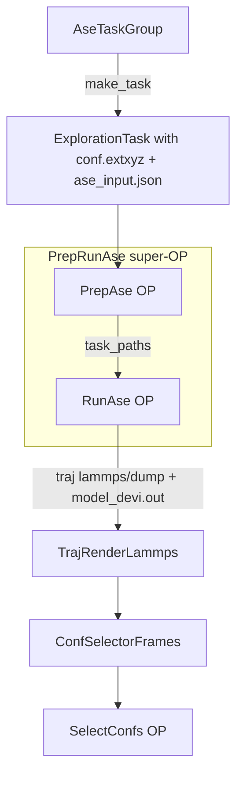
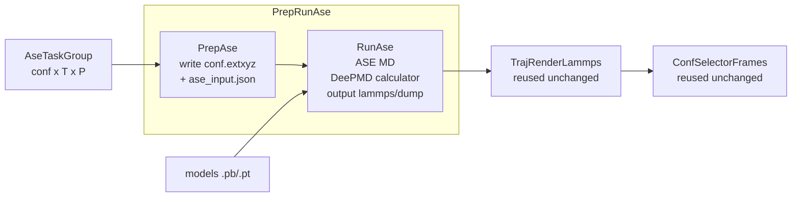

# Plan: Add ASE Exploration Support to DPGEN2

> **Status:** Draft — Risk analysis added after reviewing ASE API and existing deepmd usage in codebase.

## 1. Development Standards & Branch Naming

### From `.github/copilot-instructions.md` and the repo conventions:

**Branch naming** (following semantic commit conventions):
```
feat/ase-exploration
```

**Commit message format** (semantic commits):
```
feat(exploration): add ASE MD exploration support
```

**Code quality requirements** (enforced by pre-commit and CI):
- `ruff format dpgen2/` — code formatting
- `isort dpgen2/` — import sorting
- `velin` — numpydoc docstring formatting
- Tests must pass: `SKIP_UT_WITH_DFLOW=0 DFLOW_DEBUG=1 python -m unittest -v`

**PR checklist** (from `docs/exploration.md` step 5):
1. All unit tests pass in debug mode
2. Example config added to `examples/`
3. Example config registered in `tests/test_check_examples.py`
4. PR submitted to `deepmodeling/dpgen2`

---

## 2. Overview of What Needs to Be Built

ASE (Atomic Simulation Environment) is a widely-used Python library for atomistic simulations. Adding ASE support to the exploration phase allows users to run MD simulations (NVT, NPT, NVE, geometry optimization, etc.) using ASE calculators driven by DeePMD models, instead of being limited to LAMMPS.

The key advantage: ASE is pure Python, no external binary needed, and supports many ensemble types and integrators natively.

### Architecture Diagram



---

## 3. File-by-File Implementation Plan

### 3.1 New Constants — [`dpgen2/constants.py`](dpgen2/constants.py)

Add ASE-specific file name constants:

```python
ase_conf_name = "conf.extxyz"       # initial configuration in extended XYZ format
ase_input_name = "ase_input.json"   # ASE MD settings (ensemble, steps, etc.)
ase_traj_name = "traj.dump"         # output trajectory in lammps/dump format (reuse lmp render)
ase_model_devi_name = "model_devi.out"  # model deviation output (same format as lmp)
ase_log_name = "ase.log"            # ASE log file
ase_index_pattern = "%06d"
ase_task_pattern = "task." + ase_index_pattern
```

---

### 3.2 New Task Group — [`dpgen2/exploration/task/ase_task_group.py`](dpgen2/exploration/task/ase_task_group.py)

Modeled after [`NPTTaskGroup`](dpgen2/exploration/task/npt_task_group.py) and [`ConfSamplingTaskGroup`](dpgen2/exploration/task/conf_sampling_task_group.py).

**Key design decisions:**
- Inherits from `ConfSamplingTaskGroup` (which provides `set_conf` / `_sample_confs`)
- Stores MD parameters: ensemble, temperature, pressure, steps, timestep, traj_freq
- `make_task()` iterates over `confs × temps × press` (same as NPTTaskGroup)
- Each `ExplorationTask` contains:
  - `conf.extxyz` — initial configuration (converted from lammps dump format via dpdata or ASE)
  - `ase_input.json` — JSON with MD settings (ensemble, T, P, nsteps, dt, trj_freq, etc.)

```python
class AseTaskGroup(ConfSamplingTaskGroup):
    def set_md(
        self,
        numb_models: int,
        mass_map: List[float],
        type_map: List[str],
        temps: List[float],
        press: Optional[List[float]] = None,
        ens: str = "nvt",           # nvt, npt, nve
        dt: float = 0.001,          # ps
        nsteps: int = 1000,
        trj_freq: int = 10,
        ...
    ): ...

    def make_task(self) -> "AseTaskGroup": ...

    def _make_ase_task(self, conf, tt, pp) -> ExplorationTask: ...
```

**Configuration file format** (`ase_input.json`):
```json
{
  "ensemble": "nvt",
  "temperature": 300.0,
  "pressure": null,
  "nsteps": 1000,
  "timestep": 0.001,
  "trj_freq": 10,
  "type_map": ["Al", "Mg"],
  "numb_models": 4
}
```

---

### 3.3 Task Group Args — [`dpgen2/exploration/task/make_task_group_from_config.py`](dpgen2/exploration/task/make_task_group_from_config.py)

Add three new functions following the existing pattern:

```python
def ase_task_group_args() -> List[Argument]:
    """dargs schema for ASE MD task group parameters."""
    # conf_idx, n_sample, temps, press, ens, dt, nsteps, trj_freq, ...

def ase_normalize(data: dict) -> dict:
    """Normalize and validate ASE task group config."""

def make_ase_task_group_from_config(numb_models, mass_map, type_map, config) -> AseTaskGroup:
    """Convert config dict to AseTaskGroup."""
```

Also add `"ase-md"` to `variant_task_group()` Variant list.

---

### 3.4 New OP: PrepAse — [`dpgen2/op/prep_ase.py`](dpgen2/op/prep_ase.py)

Modeled after [`PrepLmp`](dpgen2/op/prep_lmp.py).

**Input:**
- `ase_task_grp`: `BigParameter(BaseExplorationTaskGroup)`

**Output:**
- `task_names`: `BigParameter(List[str])`
- `task_paths`: `Artifact(List[Path])`

**Logic:** Iterates over task group, writes `conf.extxyz` and `ase_input.json` to each task directory.

```python
class PrepAse(OP):
    @classmethod
    def get_input_sign(cls): ...

    @classmethod
    def get_output_sign(cls): ...

    @OP.exec_sign_check
    def execute(self, ip: OPIO) -> OPIO:
        ase_task_grp = ip["ase_task_grp"]
        # for each task: write conf.extxyz + ase_input.json
        ...
```

---

### 3.5 New OP: RunAse — [`dpgen2/op/run_ase.py`](dpgen2/op/run_ase.py)

This is the core execution OP. Modeled after [`RunRelax`](dpgen2/op/run_relax.py) (which already uses ASE internally).

**Input:**
- `config`: `BigParameter(dict)` — RunAse config (command, etc.)
- `task_name`: `BigParameter(str)`
- `task_path`: `Artifact(Path)`
- `models`: `Artifact(List[Path])`

**Output:**
- `log`: `Artifact(Path)`
- `traj`: `Artifact(Path)` — lammps dump format (reuses `TrajRenderLammps`)
- `model_devi`: `Artifact(Path)` — same format as lammps model_devi.out
- `optional_output`: `Artifact(Path, optional=True)`

**Logic:**
1. Load `ase_input.json` for MD settings
2. Load `conf.extxyz` as ASE `Atoms` object
3. Load DeePMD models using `deepmd.infer.DeepPot` (or `deepmd.calculator.DP`)
4. Set up ASE calculator using `deepmd.calculator.DP` for model[0]
5. Run MD using ASE integrators (Langevin for NVT, NPT for NPT, VelocityVerlet for NVE)
6. Every `trj_freq` steps: record frame + compute model deviation across all models
7. Write trajectory in lammps dump format (reuse `atoms2lmpdump` from `run_caly_model_devi.py`)
8. Write `model_devi.out` in same format as LAMMPS (columns: step, max_devi_v, min_devi_v, avg_devi_v, max_devi_f, min_devi_f, avg_devi_f)

**Key implementation detail:** The output trajectory format is **lammps/dump**, so `TrajRenderLammps` can be reused without modification for the selection step.

```python
class RunAse(OP):
    @classmethod
    def get_input_sign(cls): ...

    @classmethod
    def get_output_sign(cls): ...

    @OP.exec_sign_check
    def execute(self, ip: OPIO) -> OPIO:
        import ase
        import ase.md
        from deepmd.calculator import DP
        from deepmd.infer import DeepPot
        from deepmd.infer.model_devi import calc_model_devi_f, calc_model_devi_v

        # 1. Read settings
        # 2. Load atoms from conf.extxyz
        # 3. Set up DP calculator
        # 4. Run MD with trajectory recording
        # 5. Compute model deviations
        # 6. Write lammps dump + model_devi.out
        ...

    @staticmethod
    def ase_args() -> List[Argument]:
        """dargs schema for RunAse config."""
        # model_frozen_head, use_hdf5, extra_output_files

    @staticmethod
    def normalize_config(data={}) -> dict: ...
```

---

### 3.6 New Super-OP: PrepRunAse — [`dpgen2/superop/prep_run_ase.py`](dpgen2/superop/prep_run_ase.py)

Modeled after [`PrepRunLmp`](dpgen2/superop/prep_run_lmp.py).

**Inputs:**
- `block_id`: `InputParameter(str)`
- `explore_config`: `InputParameter()`
- `expl_task_grp`: `InputParameter()`
- `type_map`: `InputParameter()`
- `models`: `InputArtifact()`

**Outputs:**
- `task_names`: `OutputParameter()`
- `logs`: `OutputArtifact()`
- `trajs`: `OutputArtifact()`
- `model_devis`: `OutputArtifact()`
- `optional_outputs`: `OutputArtifact()`

**Steps:**
1. `prep-ase` step (PrepAse OP) — prepares task directories
2. `run-ase` step (RunAse OP, sliced) — runs ASE MD in parallel

```python
class PrepRunAse(Steps):
    def __init__(
        self,
        name: str,
        prep_op: Type[OP],   # PrepAse
        run_op: Type[OP],    # RunAse
        prep_config: Optional[dict] = None,
        run_config: Optional[dict] = None,
        upload_python_packages: Optional[List[os.PathLike]] = None,
    ): ...
```

---

### 3.7 Update `dpgen2/entrypoint/args.py`

Add `run_ase_args()` and `ase_args()` functions, and register `"ase"` in `variant_explore()`:

```python
def run_ase_args():
    """Config args for RunAse (model_frozen_head, use_hdf5, etc.)"""
    ...

def ase_args():
    """Top-level explore args for ASE (config, max_numb_iter, convergence, configurations, stages, filters)"""
    ...

def variant_explore():
    return Variant(
        "type",
        [
            Argument("lmp", dict, lmp_args(), doc=doc_lmp),
            Argument("calypso", dict, caly_args(), doc=doc_calypso),
            Argument("calypso:default", dict, caly_args(), doc=doc_calypso),
            Argument("calypso:merge", dict, caly_args(), doc=doc_calypso),
            Argument("diffcsp", dict, diffcsp_args(), doc=doc_diffcsp),
            Argument("ase", dict, ase_args(), doc=doc_ase),   # NEW
        ],
        doc=doc,
    )
```

---

### 3.8 Update `dpgen2/entrypoint/submit.py`

**In `make_concurrent_learning_op()`:** Add `elif explore_style == "ase":` branch:

```python
elif explore_style == "ase":
    prep_run_explore_op = PrepRunAse(
        "prep-run-ase",
        PrepAse,
        RunAse,
        prep_config=prep_explore_config,
        run_config=run_explore_config,
        upload_python_packages=upload_python_packages,
    )
```

**In `make_naive_exploration_scheduler()`:** Add `elif explore_style == "ase":` branch:

```python
elif explore_style == "ase":
    return make_ase_naive_exploration_scheduler(config)
```

**Add `make_ase_naive_exploration_scheduler()`:** Similar to `make_lmp_naive_exploration_scheduler()` — uses `TrajRenderLammps` (since output format is identical), `ConfSelectorFrames`, and `AseTaskGroup`.

**In `get_resubmit_keys()`:** Add `"run-ase"` to the sort list:

```python
sub_keys = sort_slice_ops(
    sub_keys,
    ["run-train", "run-lmp", "run-fp", "diffcsp-gen", "run-relax", "run-ase"],  # add run-ase
)
```

Also update `print_list_steps` call similarly.

---

### 3.9 Update `__init__.py` Files

**[`dpgen2/exploration/task/__init__.py`](dpgen2/exploration/task/__init__.py):** Export `AseTaskGroup`, `ase_normalize`, `ase_task_group_args`, `make_ase_task_group_from_config`.

**[`dpgen2/op/__init__.py`](dpgen2/op/__init__.py):** Export `PrepAse`, `RunAse`.

**[`dpgen2/superop/__init__.py`](dpgen2/superop/__init__.py):** Export `PrepRunAse`.

---

### 3.10 Update `dpgen2/exploration/task/make_task_group_from_config.py`

Import `AseTaskGroup` and add `"ase-md"` to `variant_task_group()`.

---

## 4. Key Technical Decisions

### 4.1 Output Format: Reuse LAMMPS Trajectory Render

The `RunAse` OP outputs trajectory in **lammps/dump** format and model deviation in the same column format as LAMMPS. This means:
- `TrajRenderLammps` can be reused **without modification**
- `ConfSelectorFrames` works unchanged
- The selection pipeline is identical to the LMP path

The `atoms2lmpdump()` function from [`dpgen2/op/run_caly_model_devi.py`](dpgen2/op/run_caly_model_devi.py) can be reused directly.

### 4.2 Model Deviation Calculation

Use `deepmd.infer.model_devi.calc_model_devi_f` and `calc_model_devi_v` (same as `RunRelax`). For each trajectory frame:
1. Evaluate all N models on the frame
2. Compute std of forces → max/min/avg_devi_f
3. Compute std of virials → max/min/avg_devi_v

### 4.3 Configuration Format

Initial configurations are stored as **extended XYZ** (`.extxyz`) format, which ASE reads natively. The `AseTaskGroup` converts lammps dump format (from `ConfSamplingTaskGroup.set_conf`) to extxyz using `dpdata` or ASE's `io.read`.

### 4.4 ASE Ensembles Supported

| `ens` value | ASE integrator | Notes |
|-------------|---------------|-------|
| `nvt` | `ase.md.langevin.Langevin` | NVT with Langevin thermostat |
| `npt` | `ase.md.nptberendsen.NPTBerendsen` or `ase.md.npt.NPT` | NPT |
| `nve` | `ase.md.verlet.VelocityVerlet` | NVE microcanonical |
| `opt` | `ase.optimize.BFGS` or `FIRE` | Geometry optimization |

### 4.5 Dependencies

ASE is already used in `run_relax.py` and `run_caly_model_devi.py` (imported inside `execute()`). No new top-level dependency needed in `pyproject.toml` — ASE is already a transitive dependency via `lam_optimize`. However, it should be added as an optional dependency or documented.

---

## 5. File Structure Summary

```
dpgen2/
├── constants.py                          # ADD: ase_conf_name, ase_input_name, etc.
├── op/
│   ├── __init__.py                       # ADD: PrepAse, RunAse exports
│   ├── prep_ase.py                       # NEW
│   └── run_ase.py                        # NEW
├── superop/
│   ├── __init__.py                       # ADD: PrepRunAse export
│   └── prep_run_ase.py                   # NEW
├── exploration/
│   └── task/
│       ├── __init__.py                   # ADD: AseTaskGroup, ase_normalize, etc.
│       ├── ase_task_group.py             # NEW
│       └── make_task_group_from_config.py  # MODIFY: add ase functions + variant
└── entrypoint/
    ├── args.py                           # MODIFY: add ase_args(), variant_explore()
    └── submit.py                         # MODIFY: integrate ASE in 3 places

tests/
├── exploration/
│   └── test_make_task_group_from_config.py  # MODIFY: add ASE test cases
├── op/
│   └── test_run_ase.py                   # NEW
└── test_prep_run_ase.py                  # NEW

examples/
└── ase/
    └── input.json                        # NEW: example ASE exploration config
```

---

## 6. Unit Tests Plan

### 6.1 `tests/exploration/test_make_task_group_from_config.py` (modify)
- Test `ase_normalize()` with valid and invalid configs
- Test `make_ase_task_group_from_config()` produces correct `AseTaskGroup`
- Test `AseTaskGroup.make_task()` produces correct number of tasks

### 6.2 `tests/op/test_run_ase.py` (new)
- Mock DeePMD models
- Test `RunAse.execute()` produces `traj.dump` and `model_devi.out`
- Verify output format matches lammps dump format
- Verify model_devi.out has correct columns

### 6.3 `tests/test_prep_run_ase.py` (new)
- Mock `PrepAse` and `RunAse`
- Construct `PrepRunAse` super-OP
- Submit workflow in `DFLOW_DEBUG=1` mode
- Verify outputs: `trajs`, `model_devis`, `logs`

---

## 7. Example Config

```json
{
  "explore": {
    "type": "ase",
    "config": {
      "model_frozen_head": null
    },
    "max_numb_iter": 10,
    "fatal_at_max": true,
    "output_nopbc": false,
    "convergence": {
      "type": "adaptive",
      "level": 0.3
    },
    "configurations": [
      {"type": "file", "files": ["POSCAR"]}
    ],
    "stages": [
      [
        {
          "type": "ase-md",
          "conf_idx": [0],
          "temps": [300, 600],
          "press": [1.0],
          "ens": "nvt",
          "dt": 0.001,
          "nsteps": 1000,
          "trj_freq": 10
        }
      ]
    ]
  }
}
```

---

## 8. Branch and PR Strategy

**Branch name:** `feat/ase-exploration`

**Commit sequence:**
1. `feat(constants): add ASE file name constants`
2. `feat(exploration): add AseTaskGroup and task group config`
3. `feat(op): add PrepAse and RunAse operators`
4. `feat(superop): add PrepRunAse super-OP`
5. `feat(entrypoint): integrate ASE exploration into workflow`
6. `test: add unit tests for ASE exploration`
7. `docs: add ASE exploration example and documentation`

**PR title:** `feat(exploration): add ASE MD exploration support`

---

## 9. Workflow Diagram



---

## 10. Risk Analysis & Unresolved Questions

After reviewing the existing ASE usage in the codebase (`run_relax.py`, `run_caly_model_devi.py`, `prep_caly_input.py`) and the deepmd calculator interface, the following risks and design questions need to be resolved before or during implementation.

---

### Risk 1: `deepmd.calculator.DP` vs `deepmd.infer.DeepPot` — Two Different Interfaces

**Problem:** The codebase uses two different deepmd interfaces:
- `deepmd.calculator.DP` — ASE-compatible calculator, used in calypso (`prep_caly_input.py` line 56, 130: `calc = DP(model=sys.argv[1])`)
- `deepmd.infer.DeepPot` — lower-level inference, used in `run_relax.py` and `run_caly_model_devi.py` for model deviation calculation

For `RunAse`, we need **both**:
- `DP` calculator to drive the MD (attached to `atoms.calc`)
- `DeepPot` instances for all N models to compute model deviation

**Risk:** `deepmd.calculator.DP` API may differ between deepmd v2 (TF) and deepmd v3 (PyTorch). The constructor signature `DP(model=path)` is confirmed in calypso code, but the `type_map` handling may differ.

**Mitigation:** Follow the same pattern as `run_relax.py` — use `DeepPot` for all models including model[0], and compute forces/virials manually rather than relying on the ASE calculator's `get_forces()`. This avoids double-evaluation.

**Alternative approach (more efficient):** Use `DP` calculator for model[0] to drive MD, then call `DeepPot.eval()` on models[1..N] only for deviation. Model[0] forces come from the calculator result already cached in `atoms.calc.results`.

---

### Risk 2: ASE NPT Ensemble — Two Different Implementations

**Problem:** ASE has two NPT implementations with different APIs:
- `ase.md.nptberendsen.NPTBerendsen` — Berendsen barostat, simpler, less rigorous
- `ase.md.npt.NPT` — Martyna-Tobias-Klein (MTK) barostat, more rigorous, but requires `externalstress` parameter as a 3×3 tensor or scalar

The `NPT` class constructor is:
```python
NPT(atoms, timestep, temperature_K=None, externalstress=0,
    ttime=25*fs, pfactor=None, ...)
```
where `pfactor` controls the barostat coupling. If `pfactor=None`, the cell is not relaxed (NVT-like behavior despite the name).

**Risk:** Users expecting LAMMPS-style `npt` behavior (Nosé-Hoover + Parrinello-Rahman) will get different dynamics from `NPTBerendsen`. The choice of barostat significantly affects sampling quality.

**Mitigation:** Support both via `ens` parameter:
- `"nvt"` → `Langevin`
- `"npt"` → `NPTBerendsen` (simpler, closer to LAMMPS default)
- `"npt-mtk"` → `ase.md.npt.NPT` (more rigorous)
- `"nve"` → `VelocityVerlet`

Document the difference clearly. Default to `NPTBerendsen` for `"npt"` to match user expectations from LAMMPS.

---

### Risk 3: ASE Timestep Units — `fs` vs `ps`

**Problem:** ASE MD integrators take `timestep` in **ASE internal units** (eV·Å·amu system), not in femtoseconds or picoseconds directly. The conversion is:
```python
from ase.units import fs
timestep_ase = dt_in_fs * fs   # dt_in_fs is in femtoseconds
```

The LAMMPS convention in dpgen2 uses `dt` in **picoseconds** (e.g., `dt=0.001` = 1 fs). ASE's `fs` constant ≈ 10.18 (in ASE units).

**Risk:** If `dt` is passed directly without unit conversion, the timestep will be ~10,000× too large, causing immediate simulation explosion.

**Mitigation:** In `RunAse`, always convert:
```python
from ase.units import fs as ase_fs
timestep = config["dt"] * 1000 * ase_fs  # config["dt"] in ps → convert to fs → ASE units
```
Document in `ase_args()` that `dt` is in **picoseconds** (consistent with LAMMPS convention).

---

### Risk 4: ASE Langevin Temperature Parameter — `temperature_K` vs `temperature`

**Problem:** ASE's `Langevin` constructor changed between versions:
- Old API (ASE < 3.22): `Langevin(atoms, timestep, temperature, friction)` where `temperature` is in **Kelvin** (confusingly named)
- New API (ASE ≥ 3.22): `Langevin(atoms, timestep, temperature_K=T, friction=f)` — explicit `_K` suffix

**Risk:** Using the wrong parameter name causes a `TypeError` or silently uses wrong temperature.

**Mitigation:** Use `temperature_K` keyword argument (new API). Add a version check or use `try/except` for backward compatibility. The calypso code in this repo doesn't use Langevin, so there's no existing precedent to follow.

```python
try:
    dyn = Langevin(atoms, timestep, temperature_K=temp, friction=friction)
except TypeError:
    # fallback for old ASE
    dyn = Langevin(atoms, timestep, temp, friction)
```

---

### Risk 5: Model Deviation — Virial Convention Mismatch

**Problem:** The model deviation format in dpgen2 uses columns:
```
step  max_devi_v  min_devi_v  avg_devi_v  max_devi_f  min_devi_f  avg_devi_f
```

In `run_relax.py` (line 180-183), virial is computed as:
```python
virial_list[0].append(
    -atoms.get_volume() * atoms.get_stress(False).reshape(9) / len(atoms)
)
```

The `get_stress(voigt=False)` returns a 3×3 stress tensor in eV/ų. The virial per atom = `-volume × stress / natoms`.

**Risk:** `deepmd.infer.model_devi.calc_model_devi_v` expects virials in a specific shape `(nmodels, nframes, 9)`. If the shape is wrong, it silently produces incorrect deviations.

**Mitigation:** Follow exactly the same pattern as `run_relax.py` lines 154-201. The virial shape handling is already validated there.

---

### Risk 6: Configuration Format — lammps/dump → extxyz Conversion

**Problem:** `ConfSamplingTaskGroup.set_conf()` provides configurations as **lammps dump format strings** (from `dpdata`). The `AseTaskGroup` needs to store these as files that `RunAse` can read.

**Options:**
1. Store as lammps dump format (`conf.lmp`) and read with `ase.io.read(fname, format="lammps-dump-text")` — but this requires `type_map` to be embedded or passed separately
2. Store as extxyz (`conf.extxyz`) — ASE's native format, self-describing
3. Store as POSCAR/VASP format — well-supported by ASE

**Risk with option 1:** `ase.io.read` for lammps dump requires `species_order` parameter to map type IDs to element symbols. This must be passed correctly.

**Risk with option 2:** Converting lammps dump → extxyz requires dpdata or ASE, which adds complexity in `PrepAse`.

**Recommended approach:** Store as **lammps dump format** (`conf.lmp`) and pass `type_map` in `ase_input.json`. In `RunAse`, read with:
```python
atoms = ase.io.read("conf.lmp", format="lammps-dump-text",
                    species_order=type_map)
```
This avoids format conversion and reuses the existing lammps dump strings directly.

---

### Risk 7: `deepmd.calculator.DP` Type Map Handling

**Problem:** When using `DP(model=path)` as ASE calculator, the type map is inferred from the model. But if the model's type map order differs from the user's `type_map` in the config, atom types will be misassigned.

**Risk:** Silent wrong-type assignment → wrong forces → wrong model deviation → wrong selection.

**Mitigation:** After loading the DP calculator, verify:
```python
calc = DP(model=model_path)
model_type_map = calc.dp.get_type_map()  # or similar API
assert set(model_type_map) == set(type_map), "Type map mismatch"
```
Use `type_map` from config to set `species_order` when reading the conf file.

---

### Risk 8: ASE MD — No Built-in Model Deviation Callback

**Problem:** Unlike LAMMPS which writes `model_devi.out` automatically via the `compute` command, ASE has no built-in mechanism. We need to manually evaluate all N models at each `trj_freq` step.

**Two approaches:**

**Approach A — Step-by-step with callback (recommended):**
```python
def record_frame():
    # called every trj_freq steps via dyn.attach()
    atoms_copy = atoms.copy()
    # evaluate all models, compute devi, write to traj + model_devi
    ...

dyn.attach(record_frame, interval=trj_freq)
dyn.run(nsteps)
```

**Approach B — Run all steps, then re-evaluate:**
Run MD with ASE trajectory writer, then post-process trajectory to compute model deviations. This requires storing all frames in memory or on disk.

**Risk with Approach A:** The callback runs in the same Python process, so evaluating N models every `trj_freq` steps adds overhead. For large systems or many models, this could be slow.

**Risk with Approach B:** Requires reading back the trajectory, which adds I/O overhead and complexity.

**Recommendation:** Use Approach A with `dyn.attach()`. This is the standard ASE pattern and avoids storing all frames. The overhead is acceptable since `trj_freq` is typically 10-100 steps.

---

### Risk 9: `write_model_devi_out` Column Count Mismatch

**Problem:** The existing `write_model_devi_out` in `run_caly_model_devi.py` (line 327) expects `devi.shape[1] == 8` (step + 6 devi columns + 1 energy devi). But `TrajRenderLammps._load_one_model_devi` (line 66-76) reads only 7 columns (step + 6 devi, no energy devi).

**Risk:** If `RunAse` uses `write_model_devi_out` (8 columns) but `TrajRenderLammps` reads 7 columns, the column indices will be off by one, causing wrong model deviation values.

**Mitigation:** Use the same format as LAMMPS `model_devi.out` — **7 columns** (no energy deviation column). Write using `np.savetxt` directly, same as `RunLmp.write_model_devi()` in `run_relax.py` (lines 62-81):
```python
header = "%10s%19s%19s%19s%19s%19s%19s" % (
    "step", "max_devi_v", "min_devi_v", "avg_devi_v",
    "max_devi_f", "min_devi_f", "avg_devi_f",
)
np.savetxt(model_devi_file, devi, fmt=["%12d"] + ["%19.6e"] * 6, ...)
```

---

### Risk 10: `PrepRunAse` Output Signature vs `ConcurrentLearningBlock`

**Problem:** `ConcurrentLearningBlock` in `block.py` (line 92) accepts `prep_run_explore_op: Union[PrepRunLmp, PrepRunCaly, PrepRunDiffCSP]`. The block connects `prep_run_explore_op.output_artifacts["trajs"]` and `["model_devis"]` to `select_confs`.

`PrepRunLmp` outputs: `logs`, `trajs`, `model_devis`, `plm_output`, `optional_outputs`, `extra_outputs`
`PrepRunDiffCSP` outputs: `trajs`, `model_devis` (minimal)

**Risk:** If `PrepRunAse` doesn't output `logs` and `optional_outputs`, the block wiring in `block.py` may fail if it tries to access those artifacts.

**Mitigation:** Check `block.py` carefully to see which outputs are actually wired. Looking at the block, only `trajs` and `model_devis` are passed to `select_confs`. `logs` are passed to `trajs` output of the block. Design `PrepRunAse` to output at minimum: `trajs`, `model_devis`, `logs`. Make `optional_outputs` optional.

---

### Risk 11: HDF5 Support

**Problem:** `RunLmp` has an `RunLmpHDF5` variant that stores trajectories in HDF5 format for efficiency. `RunRelax` also has `RunRelaxHDF5`. The `use_hdf5` config flag selects between them.

**Risk:** If `RunAse` doesn't support HDF5, users with large trajectories will have performance issues. But implementing HDF5 adds complexity.

**Mitigation:** Implement `RunAseHDF5` as a subclass of `RunAse` (same pattern as `RunRelaxHDF5` in `run_relax.py` lines 231-243), overriding only `write_traj` and `write_model_devi` methods. Add `use_hdf5` to `run_ase_args()`.

---

### Risk 12: Initial Velocity Initialization

**Problem:** LAMMPS automatically initializes atomic velocities from a Maxwell-Boltzmann distribution at the target temperature. ASE does not do this automatically — if no velocities are set, atoms start from rest (T=0K), and the thermostat takes time to equilibrate.

**Risk:** The first few hundred steps may not sample the correct temperature, leading to poor exploration.

**Mitigation:** In `RunAse`, always initialize velocities before MD:
```python
from ase.md.velocitydistribution import MaxwellBoltzmannDistribution, Stationary, ZeroRotation
MaxwellBoltzmannDistribution(atoms, temperature_K=temp)
Stationary(atoms)   # remove center-of-mass motion
ZeroRotation(atoms) # remove angular momentum (for molecules)
```
Add a config option `init_velocities: bool = True` to allow disabling this.

---

### Summary Table

| # | Risk | Severity | Mitigation |
|---|------|----------|------------|
| 1 | `DP` vs `DeepPot` interface | Medium | Use `DeepPot` for devi, `DP` for MD drive |
| 2 | NPT ensemble choice | Medium | Support `npt`/`npt-mtk`, default to `NPTBerendsen` |
| 3 | Timestep unit (ps vs ASE units) | **High** | Always convert: `dt_ps * 1000 * ase_fs` |
| 4 | Langevin `temperature_K` API change | Medium | Use `temperature_K=` kwarg with fallback |
| 5 | Virial convention for model devi | Medium | Follow `run_relax.py` exactly |
| 6 | Config format lammps dump → ASE | Medium | Keep lammps dump, pass `type_map` for `species_order` |
| 7 | DP type map mismatch | Medium | Assert type map consistency after loading |
| 8 | No built-in model devi callback | Low | Use `dyn.attach(record_frame, interval=trj_freq)` |
| 9 | `model_devi.out` column count | **High** | Use 7-column format matching `TrajRenderLammps` |
| 10 | `PrepRunAse` output signature | Medium | Output `trajs`, `model_devis`, `logs` at minimum |
| 11 | HDF5 support missing | Low | Implement `RunAseHDF5` subclass |
| 12 | No velocity initialization | Medium | Always call `MaxwellBoltzmannDistribution` |
